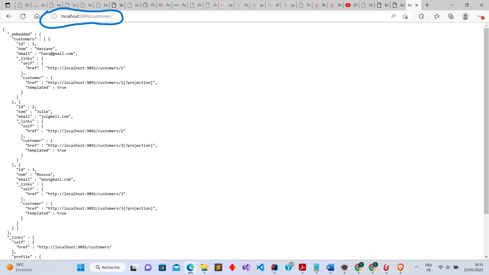
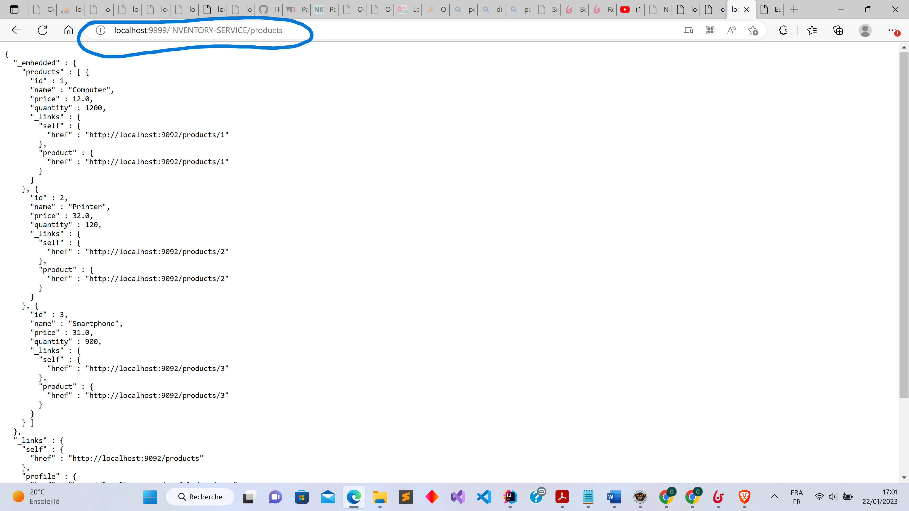

<h5>Test du Microservice inventory-service via le port 9092</h5>

<h5>Test du Microservice customer-service via le port 9091</h5>

<h4>Configuration statique 1 de la gateway dans un fichier yml</h4>

<h4>Configuration statique 2 de la gateway dans la classe de config</h4>

<h5>Accès aux microservices via la gateway avec le port 9999</h5>

<h5>Discovery Service avant activation</h5>

<h5>Discovery Service après activation de discovery.enabled à true</h5>

<h5>Configuration automatique de la gateway</h5>

<h4>Accès aux microservices via leurs noms</h4>

