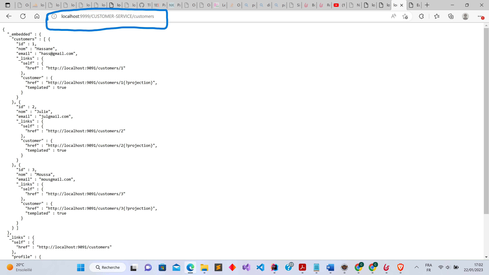
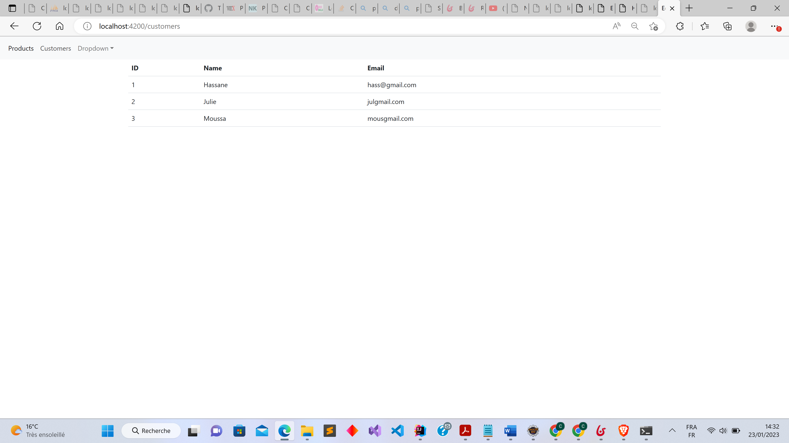

<h1>Architecture du projet</h1>

Mise en place de 3 microservices(inventory, customer et billing), d'un discovery-service et d'une gateway avec Spring côté backend. Et côté frontend, une application Angular. Pour la sécurité, on utilisera Keycloak avec JWT

Les dépendances Spring des 3 microservices : 

<ul>
    <li>Spring Web</li>
    <li>Spring Data JPA</li>
    <li>H2 Database</li>
    <li>Lombok</li>
    <li>Rest Repositories</li>
    <li>Eureka Discovery Client</li>
    <li>Spring Boot Actuator</li>
</ul>

La particularité de billing-service est qu'il va depéndre des deux autres microservices. Pour billing-service, on a va ajouter deux dependances supplémentaires

<ul>
<li>OpenFeign qui va nous permettre de faire communiquer les microservices</li>
<li>Spring HATEOAS</li>
</ul>

<h1>Partie Backend</h1>
<h5>Test du Microservice inventory-service via le port 9092</h5>

<h5>Test du Microservice customer-service via le port 9091</h5>

<h3>Configuration statique de la gateway</h3>

On a deux manière pour configurer la gateway de manière statique. Soit on utilise un fichier yml ou on utilise la classe de configuration

<h4>Configuration statique 1 des routes dans le service gateway dans un fichier yml</h4>

<h4>Configuration statique 2 des routes dans le service gateway dans la classe de config</h4>

<h4>Configuration dynamique des routes dans le service gateway dans la classe de config</h4>

<h5>Accès aux microservices via la gateway avec le port 9999</h5>

<h5>Discovery Service avant activation</h5>

<h5>Discovery Service après activation</h5>

On change la propriété spring.cloud.discovery.enabled=true des microservices et de la gateway pour leur permettre d'être visible par discovery sercice.

<h5>Configuration automatique de la gateway</h5>

<h4>Accès aux microservices via leurs noms de puis la gateway</h4>

Une fois la configuration dynamique effectuée, la gateway ne connait plus le nom des microservices. Le client(ça peut être une application front par exemple) doit preciser dans sa requete le nom du microservice pour y accéder depuis la gateway.La gateway va à son tour contacter discovery avec le nom du microservice fournit par le client et discovery lui donne l'adresse du microservice qu'elle va par la suite founir au client.

<h2>Ajout du microservie billing-service</h2>
<h4>Affichage de bills dans la base de données</h4>

<h4>Test de la méthode fullbill depuis l'adresse du microservice</h4>

<h4>Test de la méthode fullbill depuis la gateway</h4>

<h1>Partie FrontEnd avec angular</h1>
<h4>Affichage de la liste des customers</h4>

<h4>Affichage de la liste des products</h4>

<h4>Affichage de la liste des détails d'une facture</h4>

<h1>Partie Sécurité avec Keycloak</h1>

On va commencer par créer un Realm. Un Realm peut contenir plusieurs clients (applications front-end). Dans notre cas ici, notre client est l'application angular

<h4>Création d'utilisateurs et de roles</h4>

Côté backend, On va sécuriser chaque microservice (inventory, custormers et billing). Pour cela on ajoute un package security avec les classes KeycloakAdapterConfig et SecurityConfig

Generation de l'access et du refresh token

On tente d'acceder au microservice sans token, ça ne marche pas

Une fois qu'on teste avec le token, ça marche bien

<h4>Ajout de l'intercepteur à Billing service</h4>

Après avoir sécurisé chaque microservice, on se retrouve face à un problème car le service BILLING-SERVICE depend des microservices INVENTORY-SERVICE et CUSTMOMER-SERVICE. Lorsque ce microservice essaye de contacter directement les autres microservices, aucun jeton n'est envoyé. Pour palier à ce problème on va mettre en place un intercepteur dans le sercie billing, ce qui aura pour effet d'intercepter les requetes et d'ajouter le header avec le jeton.

